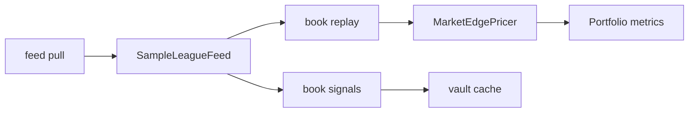

# Soccer Edge Market Scanner (SEMS)

Class-oriented TypeScript scanner for soccer betting edges — pull feeds, price markets, replay portfolio history, and emit live signals. Uses `feed` / `book` / `vault` CLI vocabulary with renamed domain types.

## Features

- **Feeds** — `SampleLeagueFeed` (in-memory) and `GithubSoccerFeed` (cached remote CSV)
- **Pricing** — `MarketEdgePricer` compares mean implied probabilities against posted odds
- **Portfolio** — `backtestRunner` with `TemporalCv` walk-forward splits
- **Vault** — Redis-backed cache layer with memory fallback
- **Distinct naming** — `AbstractFeed`, `BasePricer`, `TemporalCv` (not toolbox names)

## Quick start

**Requirements:** Node.js 20+

```bash
npm install
npm test
npm run scan -- feed schema
npm run scan -- book signals --no-cache
```

## Architecture

```
soccer-edge-market-scanner/
├── scanner/run.ts              CLI entry
├── core/                       schema.ts, frameKit.ts, checks.ts
├── feeds/                      AbstractFeed, SampleLeagueFeed, GithubSoccerFeed
├── pricing/                    BasePricer, MarketEdgePricer, ModelPricer
├── portfolio/                  backtestRunner, TemporalCv, metrics.ts
├── storage/                    redisConn, cacheLayer, cacheKeys
├── src/index.ts                Public library barrel
├── __tests__/                  Vitest tests
└── playbook/                   Scan workflow docs
```

### Scan workflow



## CLI reference

| Command | Description |
|---------|-------------|
| `feed schema` | Parameter grid manifest |
| `feed books` | Available bookmaker odds prefixes |
| `feed pull [--out dir] [--no-cache]` | Extract training matrices; optional CSV export |
| `book replay [--out dir] [--no-cache]` | Walk-forward portfolio backtest |
| `book signals [--no-cache]` | Value-bet signals on upcoming fixtures |
| `vault ping` | Redis connectivity test |
| `vault purge` | Flush `sems:` cache keys |

### Examples

```bash
npm run scan -- feed schema
npm run scan -- feed pull --out ./feeds
npm run scan -- book replay --out ./replay
npm run scan -- book signals
npm run scan -- vault ping
```

## Library API

```typescript
import {
  SampleLeagueFeed,
  MarketEdgePricer,
  backtest,
  TemporalCv,
} from "./src/index.js";

const feed = new SampleLeagueFeed();
const [X, Y, O] = feed.extractTrainData(0, "williamhill");

const pricer = new MarketEdgePricer(["williamhill"], 0.03);
pricer.fit(X, Y);

if (O) {
  const replay = backtest(pricer, X, Y, O, new TemporalCv(2));
  console.log(replay);
}
```

## Environment variables

| Variable | Default | Description |
|----------|---------|-------------|
| `REDIS_KEY_PREFIX` | `sems:` | Cache namespace |
| `REDIS_URL` / `REDIS_HOST` | — | Optional Redis |
| `REDIS_ENABLED` | `true` | Memory-only fallback when `false` |

## Scripts

| Script | Description |
|--------|-------------|
| `npm run scan` | CLI scanner |
| `npm run typecheck` | TypeScript check |
| `npm run build` | Library build |
| `npm test` | Vitest (`__tests__/`) |

## Type mapping (vs toolbox)

| SEMS | Toolbox equivalent |
|------|-------------------|
| `SampleLeagueFeed` | `DummySoccerDataLoader` |
| `MarketEdgePricer` | `OddsComparisonBettor` |
| `TemporalCv` | `TimeSeriesSplit` |
| `AbstractFeed` | `BaseDataLoader` |

## Further reading

- `playbook/scan-workflow.md` — feed → book → vault flow
